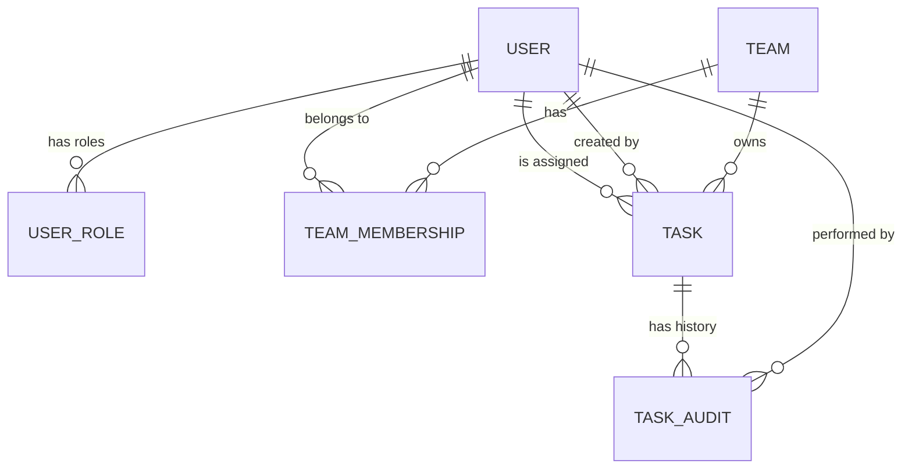

# Entity Model

## Entity Relationship Diagram

## Entity Definitions

### USER

Represents a person who can access the system as a team member or administrator.

| Attribute       | Description           | Data Type | Length/Precision | Validation Rules |
|-----------------|-----------------------|-----------|------------------|------------------|
| username        | Unique login name     | String    | 50               | Primary Key      |
| first_name      | User's first name     | String    | 100              | Not Null         |
| last_name       | User's last name      | String    | 100              | Not Null         |
| hashed_password | Hashed password value | String    | -                | Not Null         |
| picture         | User profile picture  | Binary    | -                | Optional         |

### USER_ROLE

Represents system-level role assignments for users, allowing multiple roles per user.

| Attribute | Description            | Data Type | Length/Precision | Validation Rules                                                     |
|-----------|------------------------|-----------|------------------|----------------------------------------------------------------------|
| username  | Reference to user      | String    | 50               | Not Null, Foreign Key (USER.username), Part of Composite Primary Key |
| role      | System-level role name | String    | 100              | Not Null, Part of Composite Primary Key                              |

**Constraints:** Composite primary key (username, role). A user can have multiple system-level roles (e.g., ADMIN,
USER).

### TEAM

Represents a work group that owns and manages tasks collectively.

| Attribute   | Description                 | Data Type | Length/Precision | Validation Rules      |
|-------------|-----------------------------|-----------|------------------|-----------------------|
| id          | Unique identifier           | Long      | 19               | Primary Key, Sequence |
| name        | Team display name           | String    | 100              | Not Null, Unique      |
| description | Team purpose or description | String    | 500              | Optional              |
| created_at  | Team creation timestamp     | DateTime  | -                | Not Null              |
| is_active   | Team active status          | Boolean   | 1                | Not Null              |

### TEAM_MEMBERSHIP

Represents the many-to-many relationship between users and teams.

| Attribute | Description                | Data Type | Length/Precision | Validation Rules                      |
|-----------|----------------------------|-----------|------------------|---------------------------------------|
| id        | Unique identifier          | Long      | 19               | Primary Key, Sequence                 |
| username  | Reference to user          | String    | 50               | Not Null, Foreign Key (USER.username) |
| team_id   | Reference to team          | Long      | 19               | Not Null, Foreign Key (TEAM.id)       |
| joined_at | Membership start timestamp | DateTime  | -                | Not Null                              |
| role      | Team membership role       | String    | 20               | Not Null, Values: MEMBER, LEAD        |

**Constraints:** A user can be a member of a team only once (unique combination of username and team_id).

### TASK

Represents a work item with a defined lifecycle managed by a team.

| Attribute   | Description                 | Data Type | Length/Precision | Validation Rules                              |
|-------------|-----------------------------|-----------|------------------|-----------------------------------------------|
| id          | Unique identifier           | Long      | 19               | Primary Key, Sequence                         |
| team_id     | Reference to owning team    | Long      | 19               | Not Null, Foreign Key (TEAM.id)               |
| title       | Task title or summary       | String    | 200              | Not Null                                      |
| description | Detailed task description   | String    | 2000             | Optional                                      |
| status      | Current lifecycle state     | String    | 20               | Not Null, Values: DRAFT, OPEN, ASSIGNED, DONE |
| assigned_to | Reference to assigned user  | String    | 50               | Optional, Foreign Key (USER.username)         |
| created_by  | Reference to task creator   | String    | 50               | Not Null, Foreign Key (USER.username)         |
| created_at  | Task creation timestamp     | DateTime  | -                | Not Null                                      |
| updated_at  | Last modification timestamp | DateTime  | -                | Not Null                                      |

### TASK_AUDIT

Represents the audit trail of important task state changes.

| Attribute   | Description                       | Data Type | Length/Precision | Validation Rules                                                      |
|-------------|-----------------------------------|-----------|------------------|-----------------------------------------------------------------------|
| id          | Unique identifier                 | Long      | 19               | Primary Key, Sequence                                                 |
| task_id     | Reference to task                 | Long      | 19               | Not Null, Foreign Key (TASK.id)                                       |
| changed_by  | Reference to user who made change | String    | 50               | Not Null, Foreign Key (USER.username)                                 |
| changed_at  | Timestamp of the change           | DateTime  | -                | Not Null                                                              |
| change_type | Type of change performed          | String    | 50               | Not Null, Values: CREATED, STATUS_CHANGED, ASSIGNED, UPDATED, DELETED |
| old_value   | Previous value before change      | String    | 500              | Optional                                                              |
| new_value   | New value after change            | String    | 500              | Optional                                                              |
| description | Human-readable change description | String    | 1000             | Optional                                                              |
